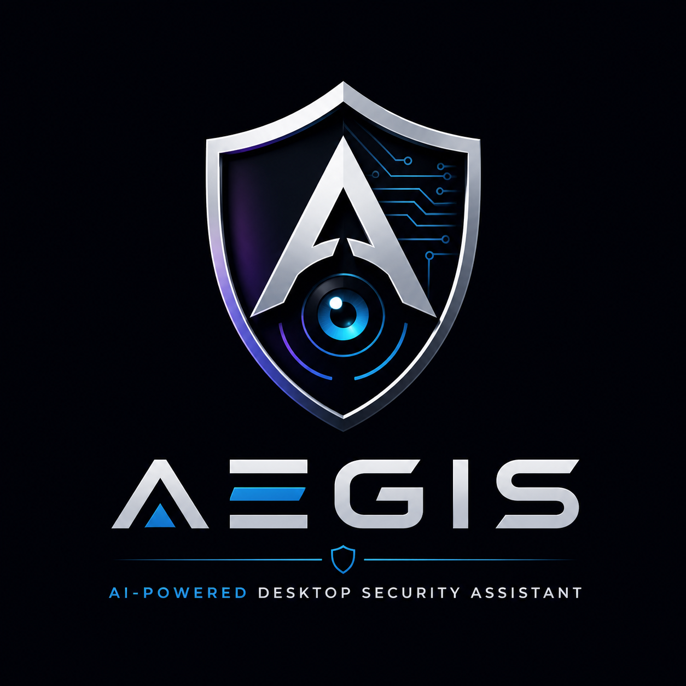
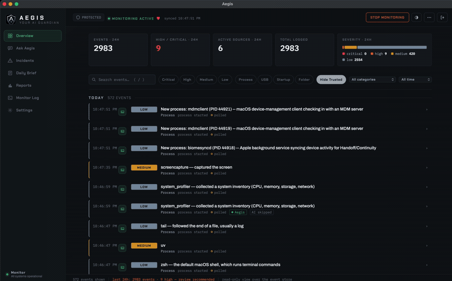
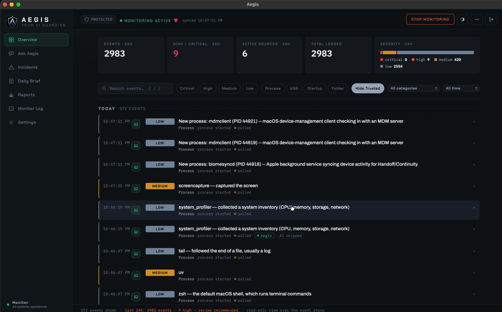
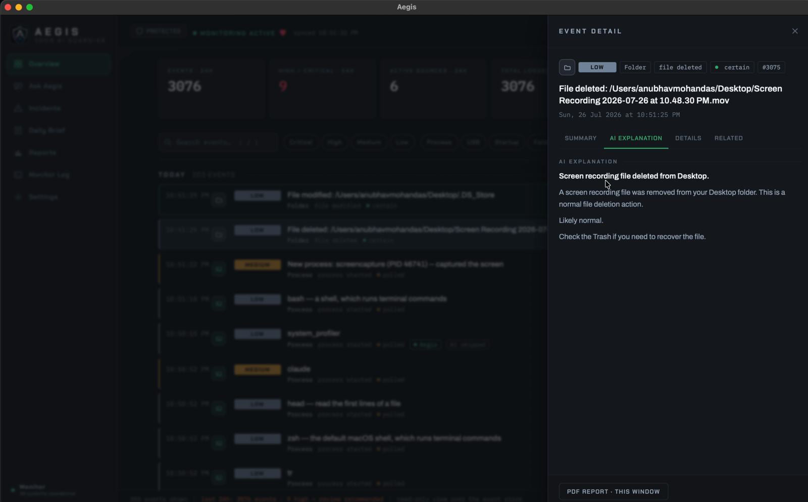
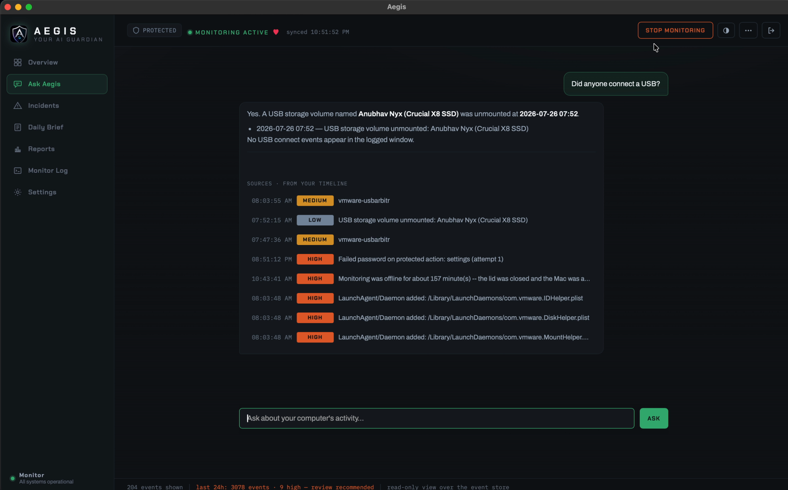

<p align="center">
  
</p>

<h1 align="center">Aegis</h1>
<p align="center"><b>AI-powered desktop security assistant for Windows, macOS, and Linux.</b></p>

<p align="center">
Your computer records everything it does and explains none of it —
<b>Aegis watches the parts that matter and tells you, in plain English,
what just happened on your machine and whether you should care.</b>
</p>

<p align="center">
  
</p>

It watches new processes, USB devices, startup persistence, and your
Desktop/Downloads/Documents folders, scores every event locally
(low/medium/high/critical) *before* any AI call, and logs everything to a
searchable timeline you can ask questions of. **Not antivirus. No security
guarantees. A personal awareness tool, not a detector.**

## Quick start

Works the same way on **Windows, macOS, and Linux** — swap only the
requirements file and the venv-activate command below for your OS.

```
python -m venv venv && source venv/bin/activate      # Windows: venv\Scripts\activate
pip install -r requirements-macos.txt                # or -windows.txt / -linux.txt
python desktop_app.py
```

`desktop_app.py` is the real app: one window, the live event console, and a
Settings page — nothing to configure by hand first. Sign in with `admin` /
`admin` on first run and change the password from Settings → Account. Add
your AI provider's API key there too (Settings → AI Explainer) — it's
encrypted at rest and, unlike the old `.env`-file approach, **survives every
self-update**, so you only ever type it once.

Prefer a headless/background process with no window (e.g. a server, or a
machine you SSH into)? `python main.py` runs the same monitors as a system-tray
app instead, and still reads `config/config.yaml` / an optional `.env` file
(`NVIDIA_API_KEY=nvapi-...`) directly for anyone who'd rather configure by
hand than through the dashboard.

The AI layer speaks to any OpenAI-compatible endpoint (NVIDIA, OpenAI,
OpenRouter, local Ollama) or Anthropic — pick provider/model/key from the
dashboard, or in `config/config.yaml` if you're running headless. Windows
needs an **Administrator** terminal for full process-monitoring power. macOS
will prompt for Automation permission the first time it checks login items.
Notification noise too high? Raise the popup floor with `notify_min_severity:
high` from Settings — everything still lands in the timeline either way.

## How it works

Every collector's only contract is to push `MonitorEvent` objects onto one
shared queue — nothing downstream knows or cares which OS produced an event, so
adding a new signal means writing one collector and changing nothing else.


The one non-obvious edge is the dotted one: the AI call is a 4–30 second
network round-trip, so the event's row lands in SQLite with a null explanation
and a worker pool fills it in later. The row is what you're waiting for; the
explanation isn't. Severity is likewise computed *before* the rate limiter, so a
burst of low-severity noise can hit the cap while a single high/critical event
never gets silently dropped for landing in a noisy window.

Full detail — every stage, every tradeoff, every known gap — in
[`ARCHITECTURE.md`](ARCHITECTURE.md).

## Screenshots

### macOS

| **Dashboard** — live stream, counts, severity split | **Any event** — opened to its plain-English explanation |
|---|---|
|  |  |



**Ask Aegis** — free-form questions over your own timeline, and every answer
cites the events it came from.

### Windows

Not shown yet, deliberately: the Windows packaged build hasn't been run on real
hardware, so there is no honest screenshot to put here. See Status below —
this section gets filled from the same script (`website/build-media.sh`) the
moment there is a real build to record.

## Status — v2.1.3

Versioning tracks validation, not features: **alpha** = features done, macOS
validated; **beta** = Windows also validated on real hardware; **2.0.0** =
public release.

- ✅ Multi-provider AI (OpenAI-compatible + Anthropic)
- ✅ macOS validation on real hardware — process, folder, USB, notifications;
  several real bugs found and fixed along the way
- ✅ Native macOS notification backend (osascript primary, plyer no longer
  involved on Mac)
- ✅ Noise reduction: opt-in trusted lists, dedupe, rate limiting, and a
  configurable popup severity floor
- ✅ Desktop app (`desktop_app.py`) — one window: live console + Settings,
  wrapping the dashboard below; `main.py`'s tray-only mode still exists for
  headless use
- ✅ Dashboard UI — live timeline with filters/search (repeated same-source
  events collapse into one expandable group), a details drawer with AI
  explanation, AI-generated PDF report export, and a Settings page
  (AI provider/key, notifications, watched folders, trust lists). Every
  event row, group, and the drawer carries a green/amber/red **trust badge**
  (OS-protected binary / your trust list / VirusTotal verdict; unknowns are
  stated in the drawer, never badged in rows), and the status bar answers
  "am I okay?" in one sentence summarizing the last 24 hours
- ✅ Ask Aegis — ask the timeline questions in plain English ("did anything
  touch my Downloads while I was away?"); answers cite the specific events
  they came from, and work without an API key via an offline fallback
- ✅ Opt-in threat enrichment — VirusTotal hash reputation (hash-only, the
  file is never uploaded; cached in SQLite so repeat binaries cost one
  lookup and verdicts work offline) plus offline MITRE ATT&CK annotations,
  surfaced in the drawer and fed to the AI as structured evidence
- ✅ Away Sessions & tamper evidence — screen lock/unlock bracket what
  happened while you were gone, and repeated failed auth on a protected
  action (e.g. Stop Monitoring) captures webcam/screenshot evidence into a
  stored, password-gated Incident
- ✅ Encrypted local API-key storage — set once from Settings, survives
  self-updates (previously had to be re-entered after every update: the key
  was written next to the app's own code, which self-update replaces
  wholesale)
- ✅ Changeable dashboard login password (Settings → Account) — no longer
  fixed `admin`/`admin`
- ✅ Self-update — checks GitHub Releases, downloads, and installs in place
  from Settings (packaged builds only); verified for real on macOS, Windows
  install path implemented per Inno Setup's documented behavior but not yet
  run on real Windows hardware
- ✅ Packaging: `pyinstaller packaging/aegis.spec` — macOS `.app`/`.dmg` built
  and smoke-run on real hardware; CI workflow builds both platforms
  ([`packaging/PACKAGING.md`](packaging/PACKAGING.md))
- 🔶 Windows validation, from source, on real hardware — **partial**: the
  standalone ETW probe ran and proved the trace session starts but the
  third-party library's delivery path never invokes the callback (not
  Aegis's own code; see [`docs/DECISIONS.md`](docs/DECISIONS.md)). The app
  now detects that zero-event state and automatically falls back to WMI
  polling, but that fallback path has not itself been re-run on real
  Windows hardware since being fixed — treat Windows process monitoring as
  implemented-with-fallback, not confirmed working, until the next
  on-hardware run
- 🔲 Windows **packaged build**, installer, and self-update — implemented,
  not yet run on real Windows hardware
  ([`TEST_REPORT_TEMPLATE.md`](TEST_REPORT_TEMPLATE.md))
- 🔲 Linux validation — implemented, not yet run on real Linux hardware
- 🔲 Signed releases, screenshots & demo

Full verification log, architecture, and every known gap:
**[`ARCHITECTURE.md`](ARCHITECTURE.md)**. Engineering decisions:
**[`docs/DECISIONS.md`](docs/DECISIONS.md)**.

---

<p align="center">Created with ❤️ by Anubhav </p>
