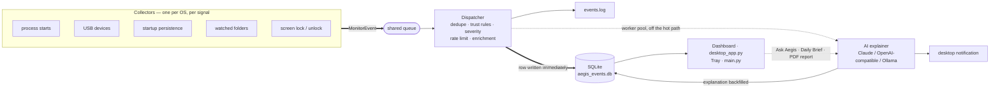

<p align="center">
  
</p>

<h1 align="center">Aegis</h1>
<p align="center"><b>AI-powered desktop security assistant for Windows, macOS, and Linux.</b></p>

<p align="center">
  <a href="https://aegis-nyx.netlify.app"><b>aegis-nyx.netlify.app</b></a> ·
  <a href="https://github.com/anubhavmohandas/Aegis/releases">Download</a> ·
  <a href="ARCHITECTURE.md">Architecture</a>
</p>

<p align="center">
Your computer records everything it does and explains none of it —
<b>Aegis watches the parts that matter and tells you, in plain English,
what just happened on your machine and whether you should care.</b>
</p>

<p align="center">
  
</p>

It watches new processes, USB devices, startup persistence, and your
Desktop/Downloads/Documents folders, scores every event locally
(low/medium/high/critical) *before* any AI call, and logs everything to a
searchable timeline you can ask questions of. **Not antivirus. No security
guarantees. A personal awareness tool, not a detector.**

## Quick start

Works the same way on **Windows, macOS, and Linux** — swap only the
requirements file and the venv-activate command below for your OS.

```
python -m venv venv && source venv/bin/activate      # Windows: venv\Scripts\activate
pip install -r requirements-macos.txt                # or -windows.txt / -linux.txt
python desktop_app.py
```

`desktop_app.py` is the real app: one window, the live event console, and a
Settings page — nothing to configure by hand first.

On Debian-family Linux (Kali, Ubuntu, …) add the one system package pip can't
provide: `sudo apt install python3-tk` — tkinter backs the password prompt that
gates Stop Monitoring and Quit, and without it that gate fails closed, so the
window refuses to close. `libnotify-bin` too if you turn desktop popups on.
[`requirements-linux.txt`](requirements-linux.txt) lists the rest.

> **First run signs in with `admin` / `admin`, then makes you replace it before
> anything else works.** That one password is not just the dashboard login: it
> is also the gate on **Stop Monitoring, Quit, Settings and Delete Evidence**,
> so leaving it at the default would mean anyone who has read this README can
> walk up to your machine and switch Aegis off. The server refuses every other
> API until it's changed — this is a real gate, not a dismissable prompt — so
> the console opens on a "set your password" dialog and nothing else loads
> until you do. Change it again later from Settings → Account; repeated wrong
> attempts on a gated action are themselves logged as a tamper Incident.

Add your AI provider's API key from Settings → AI Explainer — it's encrypted at
rest and, unlike the old `.env`-file approach, **survives every self-update**,
so you only ever type it once.

Prefer a headless/background process with no window (e.g. a server, or a
machine you SSH into)? `python main.py` runs the same monitors as a system-tray
app instead, and still reads `config/config.yaml` / an optional `.env` file
(`NVIDIA_API_KEY=nvapi-...`) directly for anyone who'd rather configure by
hand than through the dashboard.

The AI layer speaks to any OpenAI-compatible endpoint (NVIDIA, OpenAI,
OpenRouter, local Ollama) or Anthropic — pick provider/model/key from the
dashboard, or in `config/config.yaml` if you're running headless. Windows
needs an **Administrator** terminal for full process-monitoring power. macOS
will prompt for Automation permission the first time it checks login items.
Notification noise too high? Raise the popup floor with `notify_min_severity:
high` from Settings — everything still lands in the timeline either way.

## How it works

Every collector's only contract is to push `MonitorEvent` objects onto one
shared queue — nothing downstream knows or cares which OS produced an event, so
adding a new signal means writing one collector and changing nothing else.



The one non-obvious edge is the dotted one: the AI call is a 4–30 second
network round-trip, so the event's row lands in SQLite with a null explanation
and a worker pool fills it in later. The row is what you're waiting for; the
explanation isn't. Severity is likewise computed *before* the rate limiter, so a
burst of low-severity noise can hit the cap while a single high/critical event
never gets silently dropped for landing in a noisy window.

Full detail — every stage, every tradeoff, every known gap — in
[`ARCHITECTURE.md`](ARCHITECTURE.md).

## Screenshots

### macOS

| **Dashboard** — live stream, counts, severity split | **Any event** — opened to its plain-English explanation |
|---|---|
|  |  |

> **These two are due a re-shoot.** They predate the drawer redesign — the AI
> analysis now leads the drawer as a panel above the tabs, rather than sitting
> inside one. See `website/RESHOOT.md`.


**Ask Aegis** — free-form questions over your own timeline, and every answer
cites the events it came from.

### Windows

Not shown yet, deliberately: the Windows packaged build hasn't been run on real
hardware, so there is no honest screenshot to put here. See Status below —
this section gets filled from the same script (`website/build-media.sh`) the
moment there is a real build to record.

## Status — v2.1.3

Versioning tracks validation, not features — but the version number is not the
claim, this list is. A release going out does not mean a platform got proven on
hardware; macOS is validated, Windows and Linux are implemented and unproven.
Read the ticks below, not the number above.

- ✅ Multi-provider AI (OpenAI-compatible + Anthropic)
- ✅ macOS validation on real hardware — process, folder, USB, notifications;
  several real bugs found and fixed along the way
- ✅ Native macOS notification backend (osascript primary, plyer no longer
  involved on Mac)
- ✅ Noise reduction: opt-in trusted lists, dedupe, rate limiting, and a
  configurable popup severity floor
- ✅ Desktop app (`desktop_app.py`) — one window: live console + Settings,
  wrapping the dashboard below; `main.py`'s tray-only mode still exists for
  headless use
- ✅ Dashboard UI — live timeline with filters/search (repeated same-source
  events collapse into one expandable group), AI-generated PDF report export,
  and a Settings page (AI provider/key, notifications, watched folders, trust
  lists). Every event row, group, and the drawer carries a green/amber/red
  **trust badge** (OS-protected binary / your trust list / VirusTotal verdict;
  unknowns are stated in the drawer, never badged in rows), and the status bar
  answers "am I okay?" in one sentence summarizing the last 24 hours
- ✅ Investigation drawer — opening an event leads with the verdict and the AI's
  reading of it, not a grid of metadata: **severity** (how bad, if we read it
  right) beside **confidence** (how well the signals back that up), then the
  plain-English analysis, then one recommended action with the exact signals
  that triggered it. Evidence sits below in **Forensics / Raw / Related** —
  a signal table where every dimension Aegis can weigh gets a row, including
  the ones it could not check ("Reputation · Not queried" rather than silence).
  No 0-100 risk score: severity has four levels, so a number would invent
  precision the engine cannot distinguish
- ✅ Ask Aegis — ask the timeline questions in plain English ("did anything
  touch my Downloads while I was away?"); answers cite the specific events
  they came from, and work without an API key via an offline fallback
- ✅ Optional threat enrichment — when enabled, Aegis enriches the events that
  warrant it with VirusTotal reputation and MITRE ATT&CK mappings before
  generating the AI explanation, and shows both in the drawer.
  **Files are never uploaded** — only the sha256 computed locally is sent, so
  VirusTotal is asked "have you seen this hash", never handed the file. MITRE
  mapping is fully offline; verdicts cache in SQLite and keep working offline
- ✅ Away Sessions & tamper evidence — screen lock/unlock bracket what
  happened while you were gone, and repeated failed auth on a protected
  action (e.g. Stop Monitoring) captures webcam/screenshot evidence into a
  stored, password-gated Incident
- ✅ Encrypted local API-key storage — set once from Settings, survives
  self-updates (previously had to be re-entered after every update: the key
  was written next to the app's own code, which self-update replaces
  wholesale)
- ✅ Mandatory first-run password — the shipped `admin`/`admin` gets you in
  and nothing else: the server refuses every other route until you replace it,
  so the password guarding Stop Monitoring, Quit, Settings and Delete Evidence
  can never quietly stay at the documented default. Changeable again any time
  from Settings → Account, and changing it ends every existing session
- ✅ Event retention — the store ages ordinary events out after
  `retention_days` (90 by default, `0` keeps everything) and `events.log`
  rotates at 5MB × 3; tamper Incidents are never pruned by either
- ✅ Self-update — checks GitHub Releases, downloads, and installs in place
  from Settings (packaged builds only); verified for real on macOS, Windows
  install path implemented per Inno Setup's documented behavior but not yet
  run on real Windows hardware
- ✅ Packaging: `pyinstaller packaging/aegis.spec` — macOS `.app`/`.dmg` built
  and smoke-run on real hardware; CI workflow builds both platforms
  ([`packaging/PACKAGING.md`](packaging/PACKAGING.md))
- 🔶 Windows validation, from source, on real hardware — **partial**: the
  standalone ETW probe ran and proved the trace session starts but the
  third-party library's delivery path never invokes the callback (not
  Aegis's own code; see [`docs/DECISIONS.md`](docs/DECISIONS.md)). The app
  now detects that zero-event state and automatically falls back to WMI
  polling, but that fallback path has not itself been re-run on real
  Windows hardware since being fixed — treat Windows process monitoring as
  implemented-with-fallback, not confirmed working, until the next
  on-hardware run
- 🔲 Windows **packaged build**, installer, and self-update — implemented,
  not yet run on real Windows hardware
  ([`TEST_REPORT_TEMPLATE.md`](TEST_REPORT_TEMPLATE.md))
- 🔲 Linux validation — collectors (psutil diff / pyudev netlink / XDG
  autostart), dashboard and desktop window are implemented and run from source;
  not yet run on real Linux hardware. No packaged build and no self-update on
  Linux — "Check for Updates" now says that outright instead of reporting
  you're on the latest version
- ✅ Screenshots & demo — macOS only, rebuilt from source recordings by
  [`website/build-media.sh`](website/build-media.sh); Windows shots wait on a
  real Windows build
- 🔲 Signed releases

Full verification log, architecture, and every known gap:
**[`ARCHITECTURE.md`](ARCHITECTURE.md)**. Engineering decisions:
**[`docs/DECISIONS.md`](docs/DECISIONS.md)**. Release history:
**[`CHANGELOG.md`](CHANGELOG.md)**.

## Tests

Framework-free by design — every check in `tests/` is a standalone script, so
run one directly:

```
python tests/test_explain_is_async.py
```

CI ([`.github/workflows/build.yml`](.github/workflows/build.yml)) runs
`packaging/validate_runtime.py` and builds on macOS and Windows runners.

## License

[MIT](LICENSE).

---

<p align="center">Created with ❤️ by Anubhav </p>
